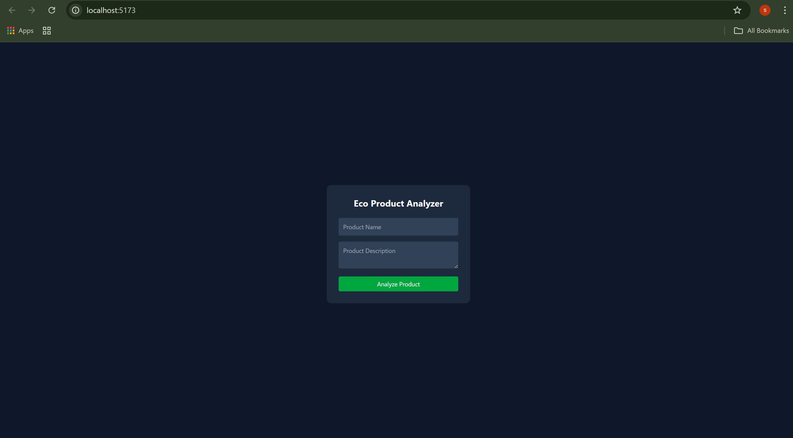
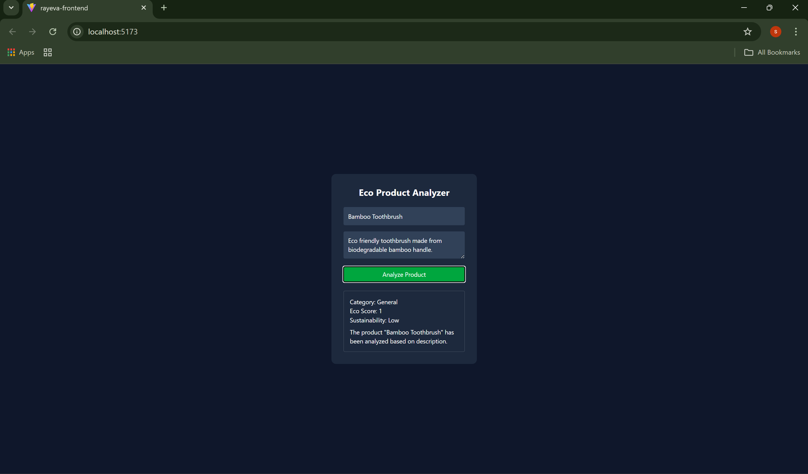

# Rayeva AI Eco Product Analysis Platform

An AI-powered full stack application that analyzes product descriptions and generates structured sustainability insights.

This project was developed as part of the **Rayeva – AI Systems Assignment** to demonstrate the integration of AI-driven analysis with real business logic for sustainable commerce platforms.

The platform allows users to input product information through a React interface and receive AI-generated sustainability insights powered by a Node.js backend.

---

## Objective

The goal of this project is to automate product intelligence using AI by:

- Automatically analyzing product descriptions
- Generating sustainability insights
- Assigning categories and tags
- Producing structured JSON outputs
- Storing analyzed product data in a database

This helps reduce manual catalog effort and improves sustainable product management for eco-commerce platforms.

---

## Tech Stack

### Backend
- Node.js
- Express.js
- MongoDB (Mongoose)
- OpenAI API (or simulated AI logic)
- dotenv

### Frontend
- React (Vite)
- Tailwind CSS
- JavaScript
- Fetch API

---

## Features

- AI-powered product analysis
- Automatic category and sub-category generation
- Sustainability scoring system
- SEO tag generation
- Sustainability filters (plastic-free, recyclable, vegan, compostable)
- Structured JSON output
- MongoDB database storage
- RESTful API architecture
- Secure environment variable handling
- Clean and responsive UI built with React + Tailwind
- Product input form for AI analysis
- Display of structured AI analysis results

---

## Project Structure

```
rayeva-ai-assignment/

backend/
   config/
      db.js
   models/
      Product.js
   routes/
      productRoutes.js
      aiRoutes.js
   server.js

frontend/
   src/
      App.jsx
      main.jsx
      index.css

package.json
.gitignore
README.md
```

---

## Installation & Setup

### 1. Clone the repository

```
git clone https://github.com/sushmita-rgb/rayeva-ai-assignment.git
cd rayeva-ai-assignment
```

---

### 2. Install backend dependencies

```
npm install
```

---

### 3. Create environment variables

Create a `.env` file in the root directory.

```
MONGO_URI=your_mongodb_connection_string
OPENAI_API_KEY=your_openai_api_key
PORT=5000
```

---

### 4. Start backend server

```
npm run dev
```

Backend server will run on:

```
http://localhost:5000
```

---

## Frontend Setup

Navigate to the frontend folder.

```
cd frontend
```

Install dependencies:

```
npm install
```

Run the frontend development server:

```
npm run dev
```

Frontend will run on:

```
http://localhost:5173
```

---

## API Endpoints

### Create Product

POST `/api/products`

Request Body

```
{
  "name": "Bamboo Bottle",
  "description": "Reusable eco friendly bamboo water bottle"
}
```

---

### Get All Products

GET `/api/products`

Returns a list of all stored products.

---

### Get Product By ID

GET `/api/products/:id`

Returns a specific product from the database.

---

### Update Product

PUT `/api/products/:id`

Updates product information.

---

### Delete Product

DELETE `/api/products/:id`

Deletes a product from the database.

---

### AI Product Analysis

POST `/api/ai/analyze`

Analyzes a product description and generates sustainability insights.

Request Body

```
{
 "name": "Bamboo Bottle",
 "description": "Reusable eco friendly bamboo water bottle"
}
```

---

## Example AI Response

```
{
 "productName": "Bamboo Bottle",
 "category": "General",
 "subCategory": "Eco Product",
 "ecoScore": 8,
 "sustainabilityLevel": "High",
 "seoTags": [
  "eco-friendly",
  "sustainable",
  "reusable",
  "plastic-free",
  "green-product"
 ],
 "sustainabilityFilters": [
  "plastic-free",
  "recyclable",
  "vegan",
  "compostable"
 ],
 "summary": "The product 'Bamboo Bottle' has been analyzed based on description."
}
```

---

## AI Prompt Design (Concept)

The AI module analyzes the product description and generates structured sustainability insights using prompt-based analysis.

The AI logic focuses on:

- Product description understanding
- Sustainability indicators
- Eco-friendly attributes
- Tag generation
- Impact scoring

The output is structured in JSON format so it can integrate easily with backend systems.

---

## Implemented Assignment Modules

This project implements two modules from the **Rayeva AI Systems Assignment**.

### Module 1 — AI Auto Category & Tag Generator

Implemented Features:

- Primary category generation
- Sub-category suggestion
- SEO tag generation
- Sustainability filters
- Structured JSON output
- MongoDB storage

---

### Module 3 — Impact Reporting (Simplified)

Implemented Features:

- Eco score generation
- Sustainability level estimation
- Impact summary generation

---

## Proposed Architecture (Not Implemented)

The following modules were conceptually designed but not implemented.

### Module 2 — AI B2B Proposal Generator

Proposed capabilities:

- Sustainable product mix recommendation
- Budget allocation within provided limits
- Estimated cost breakdown
- Impact positioning summary

---

### Module 4 — AI WhatsApp Support Bot

Proposed capabilities:

- Order status queries via WhatsApp
- Return policy automation
- Refund escalation
- AI conversation logging

---

## Security

- API keys are stored using environment variables
- `.env` is excluded from GitHub via `.gitignore`
- GitHub secret push protection enabled

---

## Future Improvements

- Add authentication using JWT
- Deploy backend to cloud (Render or Railway)
- Deploy frontend using Vercel
- Integrate real AI model responses
- Add analytics and reporting features
- Build a dashboard for product insights

---
# Project Screenshots

### Product Input UI


### AI Analysis Result

# Live Demo

Frontend Demo Video  
https://drive.google.com/file/d/1kRnGGCTP0ioI0gVaiP0qIQholEAXMjPV/view

The demo video shows:

• Product input  
• AI analysis process  
• Structured sustainability results

## Author

Sushmita Singh  
MERN Stack Developer  

Passionate about building scalable web applications and AI-powered platforms that solve real-world problems.

GitHub: https://github.com/sushmita-rgb

